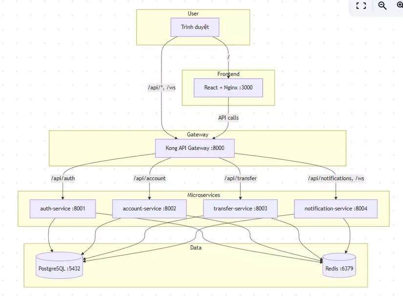

# Overview
This is my personal project to learn DevOps from Docker to Kubernertes 
# Structure 

## Main Request Flow

- **User** accesses the frontend (React) via **port 3000**.
- **Frontend** sends API requests through **Kong** (**port 8000**):
    - `/api/auth/*`
    - `/api/account/*`
    - `/api/transfer/*`
    - `/api/notifications/*`
- **WebSocket** (`/ws`) is used for real-time notifications when a new transfer occurs.
- **Kong** routes requests to the appropriate backend microservice.
- **PostgreSQL** stores users, account balances, transfers, and notifications.
- **Redis** is used for:
    - User sessions (authentication)
    - Online presence tracking
    - Pub/Sub messaging for real-time notifications

---

# Tech Stack

| Component | Technology | Description |
|-----------|------------|-------------|
| **Frontend** | React, Tailwind CSS | Single Page Application (SPA), served by Nginx |
| **Backend** | FastAPI (Python) | Four microservices |
| **API Gateway** | Kong | API routing, CORS, metrics |
| **Database** | PostgreSQL 16 | Persistent data storage |
| **Cache / Session** | Redis 7 | Session management, presence tracking, Pub/Sub |
| **Containerization** | Docker | Build and run services locally |
| **Orchestration** | Kubernetes | Production deployment |
| **Package Manager** | Helm | Kubernetes templating and configuration |
| **GitOps** | Argo CD | Continuous synchronization from Git |
| **CI/CD** | GitHub Actions | Build, test, and push container images |
| **Monitoring** | Prometheus, Grafana | Metrics collection and dashboards |
| **Logging** | Loki, Promtail | Centralized log aggregation |
| **Tracing** | Tempo, OpenTelemetry | Distributed tracing across microservices |

# 6-Session Roadmap

The project is organized into **six sessions**, with each phase introducing additional technologies and increasing the overall complexity.

| Phase            | Description |
|------------------|-------------|
| **Prerequisite** | Docker Compose deployment guide |
| **Session 1**    | Migrate from Docker Compose to Kubernetes using native Kubernetes manifests |
| **Session 2**      | Package applications with Helm and implement GitOps using Argo CD |
| **Session 3**      | Set up the observability stack, including Prometheus, Grafana, Loki, Tempo, and KEDA |
| **Session 4**      | Build a CI/CD pipeline for application delivery and database migrations using GitHub Actions |
| **Session 5**      | Improve system security, reliability, and Site Reliability Engineering (SRE) practices |
| **Session 6**      | Implement advanced deployment strategies such as Blue-Green and Canary deployments |
